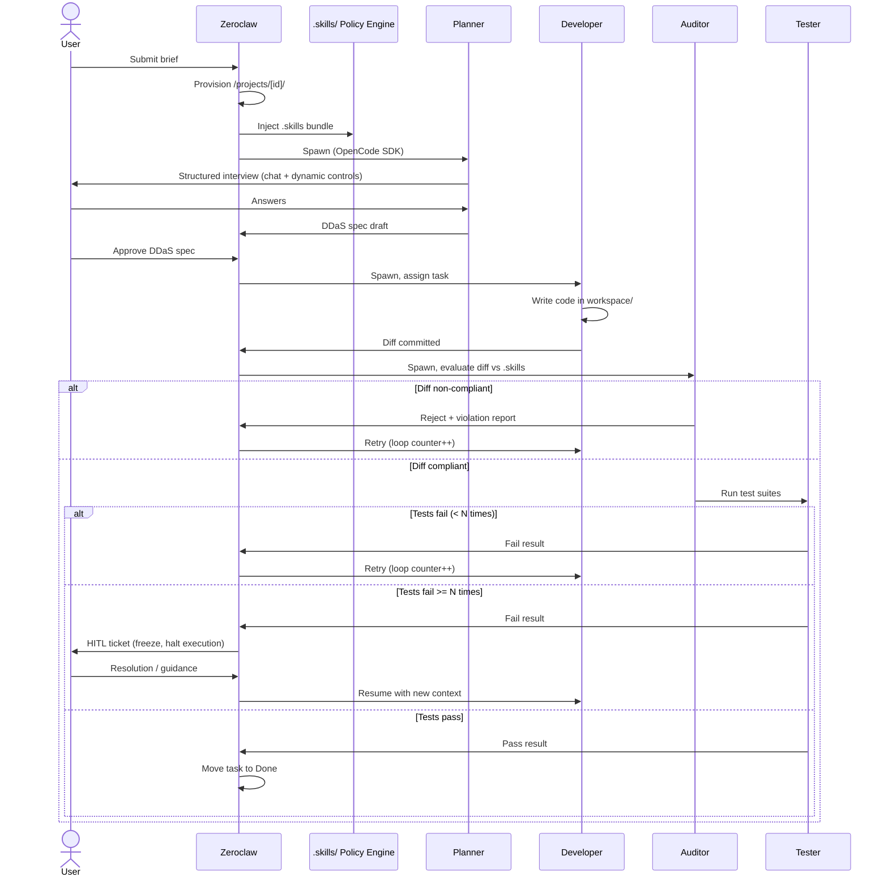
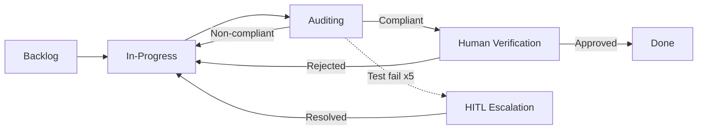
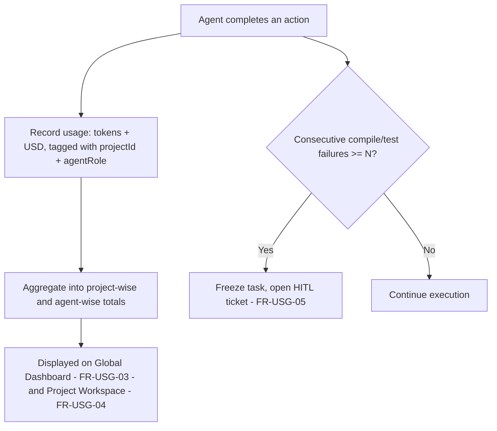
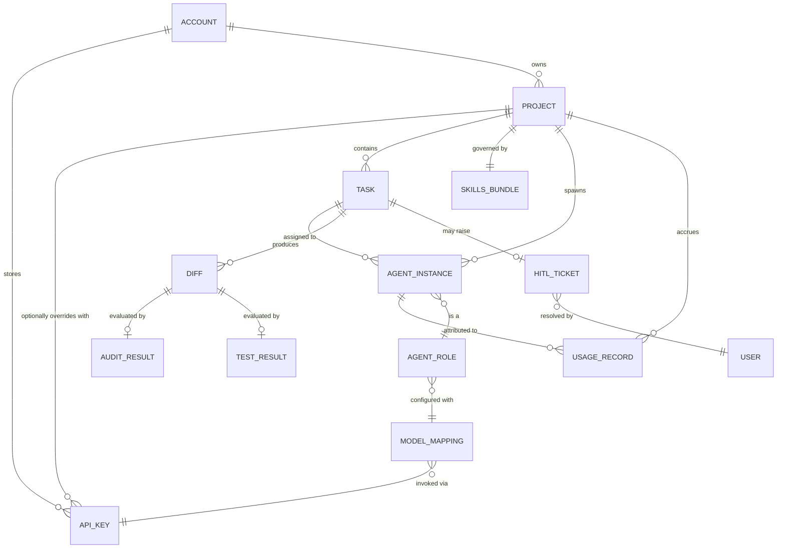

# Product Requirements Document: The Dark Factory Platform (Apex Swarm)

- **Document Version:** 2.0.0 (Derived from Baseline Specification v1.0.0)
- **Status:** Draft for Strategic Review
- **Source:** `docs/apex-swarm-overview.md`
- **Owner:** Product / Platform Engineering
- **Last Updated:** 2026-07-25

---

## 1. Strategic Overview

### 1.1 Vision
Apex Swarm ("The Dark Factory Platform") turns a plain-language product brief into production-grade, compliant software with no human in the code-writing loop by default. It replaces the developer's IDE with an **orchestrated fleet of autonomous agents** operating inside enforced process guardrails — the difference between "vibe coding" and industrialized software manufacturing.

### 1.2 Strategic Goals
| Goal | Description | Primary Metric |
| :--- | :--- | :--- |
| **G1 — Democratize delivery** | Non-technical users ship production software from a brief alone | Time from brief → first Done card |
| **G2 — Deterministic quality** | Every diff is policy-checked before merge; no unreviewed code reaches `workspace/` | % diffs blocked by Auditor / escaped-defect rate |
| **G3 — Predictable economics via BYOK** | Users bring their own LLM provider keys; the platform never resells model compute, only orchestration — spend happens directly on the user's own provider account, with transparent usage visibility layered on top | % of agent spawns backed by a valid, user-supplied key; accuracy of in-platform token/USD usage reporting vs. provider-reported spend |
| **G4 — Safe autonomy** | Runaway agents fail closed, not open | Mean time to HITL escalation after loop failure |
| **G5 — Operator trust** | A single dashboard gives full visibility with minimal cognitive load | Dashboard time-to-first-action for a paused pipeline |

### 1.3 Problem Statement
Unstructured, unsupervised AI coding produces four compounding failure modes: **agent drift** (goals decay over long sessions), **syntax/compile loops** (agents retry the same broken fix), **context bloat** (unmanageable prompt growth degrading output quality), and **unbounded cost** (token spend with no ceiling or forecast). Existing AI coding tools address one of these at a time; none combine process enforcement, multi-agent role separation, and cost governance into a single operating system for AI-built software.

### 1.4 Solution Summary
A centralized orchestrator (**Zeroclaw**) that:
1. Spawns role-specialized agents (Planner, Developer, Auditor, Tester) as isolated processes via the **OpenCode SDK**.
2. Communicates with them over **MCP (JSON-RPC 2.0)**.
3. Binds every agent to a per-project `.skills/` policy bundle (company profile, brand guidelines, SDLC rules, DDaS schema) that cannot be bypassed.
4. Runs on a **BYOK (Bring Your Own Key) model by default** — users supply their own LLM provider API keys per agent role (§3.4.1); the platform orchestrates but does not resell model compute or operate a wallet in v1.
5. Tracks **token and USD usage** per project and per agent role (simplified v1 scope — see §3.4) purely for visibility into the user's own provider spend, with runaway-loop circuit breakers as an independent safety mechanism.
6. Surfaces state, usage, and required human decisions through a single **Mission Control** dashboard and per-project **Interactive Factory Board**.

### 1.5 Target Users / Personas
| Persona | Description | Primary Need |
| :--- | :--- | :--- |
| **Non-technical Founder** | Has a product idea, no engineering staff | Turn a brief into working software without hiring — needs guided help obtaining/entering a provider API key, since BYOK is required to run any agent |
| **Technical Product Owner** | Can read code/specs, doesn't want to write boilerplate; typically the one who provisions and manages provider API keys | Oversight + ability to intervene at HITL gates; confidence that supplied keys are stored securely and mapped to the right agent roles |
| **Platform Operator / Ops Lead** | Manages multiple concurrent projects across a team or agency | Fleet-wide visibility, usage transparency, compliance guarantees |
| **Compliance / Brand Reviewer** | Owns company profile & brand guardrails | Confidence that generated output can't violate policy |

### 1.6 Success Metrics (KPIs)
- **Adoption:** # of projects provisioned / week; % reaching first "Done" card.
- **Quality:** Auditor block rate on first pass; post-merge defect rate; test pass rate on first Tester run.
- **Cost visibility:** Accuracy of token/USD usage reporting per project and per agent role; # of runaway-loop freezes triggered. (Full platform-hosted cost-control economics — pre-flight estimate variance, burn efficiency — are rejected permanently, not deferred; see §3.4.3.)
- **BYOK health:** % of agent roles with a valid, currently-passing key check; median time from "key invalid" detection to user re-entering a working key.
- **Trust/UX:** Median time from HITL alert to human action; dashboard state-update latency (<200ms target, §7 NFR).
- **Reliability:** Crash-recovery success rate; concurrent-instance ceiling reached without desync (target: 50/node).

### 1.7 Out of Scope (v1)
- Multi-cloud / multi-region agent execution (single workspace node assumed for the 50-instance NFR).
- Marketplace for third-party `.skills` bundles.
- Non-code artifacts (e.g., legal contracts, marketing copy) as a primary output type.
- Autonomous production deployment / infra provisioning beyond the `workspace/` sandbox (CI/CD hand-off is a future phase, see §9).
- Platform-hosted, wallet-based reselling of model compute — wallet, credit tiers/multipliers, pre-flight cost-approval gating, burn-rate/runway forecasting. **There will be no self-hosted/platform-hosted mode — BYOK is the permanent architecture, not a v1-only simplification.** Users supply their own provider keys, and the platform ships simplified, read-only token + USD usage visibility on top of that (see §3.4.1/§3.4.2).

---

## 2. System Architecture (Reference)

```
┌──────────────────────────────────────────────────────────────────────────────────┐
│                             ZEROCLAW ORCHESTRATOR                                │
│          (Translates User Intent, Manages State, Enforces Process Gates)          │
└─────────┬──────────────────────────────────────────────────────────────┬─────────┘
          │ (MCP Protocol / JSON-RPC 2.0)                                │ (Reads Manifest)
          ▼                                                              ▼
┌──────────────────────────────────────┐               ┌───────────────────────────┐
│            OPENCODE SDK              │               │     ENFORCED .skills/     │
│   (Dynamic Agent Process Runtime)    │               │  Company Profile & Brand  │
├──────────────────────────────────────┤               │  SDLC & Testing Protocols │
│  Planner   │  Auditor                │               │  DDaS Matrix Guidelines   │
│  Developer │  Tester                 │               └─────────────┬─────────────┘
└─────────┬────────────────────────────┘                             │
          ▼                                                          ▼
┌──────────────────────────────────────────────────────────────────────────────────┐
│                         ISOLATED PROJECT DIRECTORY  /projects/[project_id]/       │
│   ├── .skills/   (Injected Guardrails)   ├── workspace/ (App Code)   ├── logs/    │
└──────────────────────────────────────────────────────────────────────────────────┘
```

Four architectural layers, each owned by a distinct requirement set in §3:
1. **Control plane** — Zeroclaw (state machine, HITL, usage ledger).
2. **Execution plane** — OpenCode SDK agent processes.
3. **Policy plane** — `.skills/` bundle, enforced at file-system/command level.
4. **Presentation plane** — Mission Control + Project Workspace UI.

---

## 3. Functional Requirements

Each requirement has an ID, priority (P0 = launch-blocking, P1 = near-term, P2 = later phase), and acceptance criteria. IDs are referenced by the correlation matrix in §6.

### 3.1 Orchestration Core (Zeroclaw) — `FR-ORC`

| ID | Requirement | Priority | Acceptance Criteria |
| :--- | :--- | :--- | :--- |
| FR-ORC-01 | System shall accept a free-text user brief and provision an isolated project directory `/projects/[project_id]/`. | P0 | New directory with `.skills/`, `workspace/`, `logs/` created; unique project_id assigned; visible in Project Fleet Matrix within 1 request cycle. |
| FR-ORC-02 | System shall inject a default or user-selected `.skills/` bundle at provisioning time. | P0 | `.skills/company_profile.json`, `brand_guidelines.md`, `sdlc_rules.yaml`, `ddas_schema.json` present before any agent starts. |
| FR-ORC-03 | System shall act as the sole authority for spawning, sequencing, and tearing down agent processes via the OpenCode SDK. | P0 | No agent can self-spawn another agent; all lifecycle transitions logged with actor = Zeroclaw. |
| FR-ORC-04 | System shall maintain a durable state machine per project (phase, active agent, task queue) surviving process restarts. | P0 | Restarting Zeroclaw resumes each project at its last committed DDaS checkpoint (see FR-NFR-03). |
| FR-ORC-05 | System shall enforce sequential handoffs between agent roles per the defined workflow (Planner → Developer → Auditor/Tester → Done/HITL). | P0 | Developer cannot begin before DDaS spec is marked Approved; Auditor/Tester invoked automatically after every Developer diff. |
| FR-ORC-06 | System shall raise a Human-in-the-Loop (HITL) ticket whenever a defined trigger condition is met (test failure threshold, ambiguous spec). | P0 | Ticket appears in Attention Required Queue within 1 orchestration cycle of trigger; pipeline execution pauses on that project. |
| FR-ORC-07 | System shall route all inter-agent and agent-to-orchestrator communication exclusively over MCP (JSON-RPC 2.0). | P0 | No direct agent-to-agent or agent-to-filesystem-outside-sandbox calls observed in audit logs. |

### 3.2 Agent Fleet — `FR-AGT`

| ID | Requirement | Priority | Acceptance Criteria |
| :--- | :--- | :--- | :--- |
| FR-AGT-01 | **Planner/Interviewer Agent** shall conduct a structured discovery session with the user and produce a DDaS specification artifact. | P0 | Output is a schema-valid DDaS document per `ddas_schema.json`; interview supports dynamic UI controls (radio, checkbox) per FR-UI-06. |
| FR-AGT-02 | **Developer Agent** shall write/refactor code exclusively within `/projects/[id]/workspace/`. | P0 | 100% of file writes resolve to paths under `workspace/`; writes outside sandbox rejected at the OS/sandbox layer. |
| FR-AGT-03 | **Auditor Agent** shall evaluate every Developer diff against the active `.skills/` bundle before it can proceed to Done. | P0 | Non-compliant diffs (brand, SDLC, lint, coverage) are blocked with a machine-readable violation report attached to the task card. |
| FR-AGT-04 | **Tester Agent** shall execute unit, integration, and syntax test suites against each diff and stream pass/fail results to the Auditor and Zeroclaw. | P0 | Test results appear in Live Factory Terminal within the NFR latency budget; failure count increments the runaway-loop counter (FR-USG-05). |
| FR-AGT-05 | Each agent role shall be independently mappable to a specific LLM/model **and the BYOK provider key that pays for it** (FR-KEY-01) in project Pre-Flight Config. | P0 | Config UI persists a role→model→key mapping; Zeroclaw invokes the configured model via the mapped key at spawn time; spawn blocks with a setup prompt (FR-KEY-04) if the mapped key is invalid. |
| FR-AGT-06 | Agents shall be terminated ("spun down") automatically once their assigned task reaches a terminal state (Done, Blocked, Failed). | P1 | No orphaned OpenCode SDK processes remain after task terminal state; verified via process/resource audit. |

### 3.3 Directory Isolation & `.skills` Policy Engine — `FR-SKL`

| ID | Requirement | Priority | Acceptance Criteria |
| :--- | :--- | :--- | :--- |
| FR-SKL-01 | Every project shall have a dedicated, non-shared filesystem root; agents cannot read/write/execute outside it. | P0 | Path traversal attempts (e.g., `../`) outside `/projects/[project_id]/` are blocked and logged as security events. |
| FR-SKL-02 | `.skills/company_profile.json` shall constrain domain rules, regulatory compliance requirements, and vocabulary available to agents. | P0 | Agent-generated content matches allowed vocabulary/compliance rules on Auditor spot-check. |
| FR-SKL-03 | `.skills/brand_guidelines.md` shall constrain visual styling, allowed UI component libraries, and theme tokens produced by the Developer Agent. | P0 | Generated UI code imports only whitelisted component libraries/tokens; deviations flagged by Auditor. |
| FR-SKL-04 | `.skills/sdlc_rules.yaml` shall define mandatory test coverage thresholds, linting standards, and maximum iteration loops. | P0 | Auditor/Tester reject merges below configured coverage %; loop counter honors configured max before HITL escalation. |
| FR-SKL-05 | `.skills/ddas_schema.json` shall define the required structure for feature documentation prior to implementation, and Developer Agent shall refuse to implement undocumented features. | P0 | No Developer task starts without a corresponding schema-valid DDaS entry. |
| FR-SKL-06 | Users shall be able to view and edit `.skills` files through the Project Workspace UI. | P1 | Edits persist to the project's `.skills/` directory and take effect on next agent spawn. |

### 3.4 BYOK & Usage Tracking (v1 Scope) — `FR-USG` / `FR-KEY`

> **Permanent architectural decision:** The platform is **BYOK-only, with no self-hosted/platform-hosted alternative planned at any phase** — every agent action runs against a provider API key the user supplies, and the platform never resells model compute or operates a wallet. On top of that, it tracks and displays **token consumption and USD-equivalent cost, broken down by project and by agent role** — read-only visibility into the user's own spend, no financial transactions on the platform side. The fuller platform-hosted credit economy described in the original baseline spec (wallet, credit tiers/multipliers, pre-flight cost-approval gating, burn-rate/runway forecasting) is **rejected outright, not deferred** — see §3.4.3 below. Runaway-loop protection (FR-USG-05) is retained as an independent reliability safeguard, decoupled from any financial framing.

#### 3.4.1 BYOK Key Management — `FR-KEY`

| ID | Requirement | Priority | Acceptance Criteria |
| :--- | :--- | :--- | :--- |
| FR-KEY-01 | System shall let users enter and store an API key per supported LLM provider (e.g., Anthropic, OpenAI, Google), scoped at the account level with an optional per-project override. | P0 | Key entry form exists in Settings and/or Pre-Flight Config; a project without an override inherits the account-level key. |
| FR-KEY-02 | Stored keys shall be encrypted at rest and never rendered in full in the UI — masked display only (e.g., last 4 characters), and never written to logs or the Live Factory Terminal. | P0 | Security review confirms no plaintext key appears in database at rest, UI DOM, or any log stream; UI shows masked value only. |
| FR-KEY-03 | System shall validate a key's connectivity/validity before allowing any agent spawn that depends on it, and re-validate on a defined cadence. | P0 | Invalid/expired key blocks the dependent agent spawn with a clear, actionable error rather than a silent failure or crash. |
| FR-KEY-04 | Each agent role's model mapping (FR-AGT-05) shall reference a specific stored provider key; spawning an agent whose mapped key is missing or invalid shall raise a setup prompt (HITL-style) instead of failing silently. | P0 | Attempting to spawn an agent role with no valid key routes the user to key entry, not a generic error. |
| FR-KEY-05 | Users shall be able to rotate or revoke a stored key. Agents currently depending on a revoked/rotated key shall pause gracefully and prompt for updated credentials rather than crash mid-task. | P1 | Revoking a key pauses (not fails) any in-flight task using it; task resumes once a valid key is supplied. |

#### 3.4.2 Usage Tracking (Simplified v1 Scope) — `FR-USG`

| ID | Requirement | Priority | Acceptance Criteria |
| :--- | :--- | :--- | :--- |
| FR-USG-01 | System shall track token consumption and USD-equivalent cost for every agent action, attributed to a project. | P0 | Every completed agent action produces a usage record with `projectId`, `tokens`, `usdCost`, `timestamp`. |
| FR-USG-02 | System shall track token consumption and USD-equivalent cost attributed to a specific agent role (Planner, Developer, Auditor, Tester) within a project. | P0 | Usage records additionally carry `agentRole`; per-role totals are queryable for any project. |
| FR-USG-03 | Global Dashboard shall display aggregate token and USD usage across all projects. | P0 | Dashboard shows a total-tokens and total-USD figure reflecting the sum of all projects' usage records. |
| FR-USG-04 | Project Dashboard (workspace) shall display token and USD usage for that project, broken down by agent role. | P0 | Workspace shows a per-agent-role usage table/chart (tokens + USD) for the current project only. |
| FR-USG-05 | System shall detect runaway loops: after N (default 5) consecutive compile/test failures on the same task, freeze the process and open an HITL ticket. | P0 | 5th consecutive failure (configurable) triggers freeze within one Tester cycle and pauses further execution on that task. |

#### 3.4.3 Rejected — Platform-Hosted Billing Economy (Permanent, Not a Future Phase)

> **Product decision:** There will be **no self-hosted / platform-hosted infrastructure profile**, ever. BYOK is not a launch-scope simplification to be revisited later — it is the permanent architecture. The platform orchestrates agents; it never resells, fronts, or meters model compute on its own wallet. Everything below is rejected outright, not queued for Phase 2/3. It is kept here only for traceability against the original baseline spec.

| Rejected ID | Original Requirement | Reason Rejected (Permanent) |
| :--- | :--- | :--- |
| FR-BIL-01 | Meter operations into 3 credit tiers with multipliers (Orchestration/Planning/Execution). | Only meaningful if the platform resells compute on a wallet — it never will. |
| FR-BIL-02 | Platform-Hosted (wallet-deducted) billing mode as an alternative to BYOK. | No self-hosted/platform-hosted mode will be built. BYOK is the only access model (§3.4.1), permanently. |
| FR-BIL-04 | Live credit "fuel gauge" with burn-rate chart and runway estimate. | Replaced permanently by the simpler token/USD usage display (FR-USG-03/04); a "runway" concept implies a platform wallet that will not exist. |
| FR-BIL-06 | Pre-flight cost estimate + required approval at phase transitions. | Only meaningful as a spend gate against a platform wallet — no such wallet will exist. |
| FR-BIL-07 | User-configurable cost thresholds. | Depends on FR-BIL-06; rejected with it. |
| FR-BIL-03 | User-defined max concurrency ceiling with queued-state UI. | Not a billing feature — this one is a legitimate resource/reliability control unrelated to the hosting-model decision, and may still be picked up as a plain operational-limits item independent of billing (see §9). |

### 3.5 Mission Control (Global Dashboard) — `FR-UI-DASH`

| ID | Requirement | Priority | Acceptance Criteria |
| :--- | :--- | :--- | :--- |
| FR-UI-DASH-01 | Root URL (`/`) shall render the primary dashboard as system entry point. | P0 | `/` renders Mission Control for authenticated users. |
| FR-UI-DASH-02 | Dashboard shall show summary metric cards: Active Executions, Usage Summary (total tokens + USD used across all projects), Action Required Badge. | P0 | All three cards render with live data; badge count matches open HITL ticket count; usage figures match FR-USG-03. |
| FR-UI-DASH-03 | Dashboard shall show an Attention Required Queue listing paused pipelines with context (project → agent → blocking reason) and a one-click "Jump to Interview/Resolution" action. | P0 | Clicking the action deep-links to the exact Interaction Hub / decision point that caused the pause. |
| FR-UI-DASH-04 | Dashboard shall show a Project Fleet Matrix (table/grid) with project name, sandbox path, active agents, current SDLC phase, and token/USD usage. | P0 | Matrix reflects real-time state for all projects the user has access to; usage columns match FR-USG-01. |
| FR-UI-DASH-05 | Navigation shall keep system-wide telemetry decoupled from primary sidebar to minimize noise. | P1 | Telemetry accessible via dedicated route, not cluttering primary nav. |

### 3.6 Project Workspace — `FR-UI-WS`

| ID | Requirement | Priority | Acceptance Criteria |
| :--- | :--- | :--- | :--- |
| FR-UI-WS-01 | Users shall switch between projects via a dropdown switcher or Projects explorer. | P0 | Switching updates all panels (Kanban, tree, chat, terminal) to the selected project's state without full page reload. |
| FR-UI-WS-02 | Pre-Flight Config screen shall let users enter/select BYOK provider keys, map LLMs (backed by those keys) to agent roles, and upload/edit `.skills` files. | P0 | Key entry, mapping, and `.skills` edits persist per FR-KEY-01, FR-AGT-05, FR-SKL-06. |
| FR-UI-WS-03 | Interactive Factory Board (Kanban) shall show columns Backlog → In-Progress → Auditing → Human Verification → Done. | P0 | Task cards move automatically as Zeroclaw transitions task state; manual drag is disabled/restricted to authorized overrides. |
| FR-UI-WS-04 | Kanban cards shall display active agent badge, task progress, and local working-directory sub-path. | P0 | Card metadata matches live orchestrator state. |
| FR-UI-WS-05 | Interaction Hub left panel shall show a real-time read-only file tree of `workspace/`. | P0 | Tree updates on file create/modify/delete within NFR latency budget. |
| FR-UI-WS-06 | Interaction Hub right panel shall provide a structured chat interface with the Planner Agent, rendering agent-generated dynamic controls (radio, checkbox, free text). | P0 | User responses to dynamic controls are captured and fed back into the DDaS interview state. |
| FR-UI-WS-07 | Live Factory Terminal shall stream MCP stdio/stdout with log-level filters (INFO, WARN, CRITICAL) and a Git-style diff inspector. | P0 | Filter toggles hide/show matching log lines client-side without re-fetch; diff inspector renders unified/side-by-side diff for any Developer commit. |
| FR-UI-WS-08 | Project Workspace shall show a Usage panel with token and USD consumption broken down by agent role for the current project. | P0 | Panel matches FR-USG-04; updates as new usage records are recorded. |

### 3.7 Human-in-the-Loop (HITL) — `FR-HITL`

| ID | Requirement | Priority | Acceptance Criteria |
| :--- | :--- | :--- | :--- |
| FR-HITL-01 | System shall pause the affected project's pipeline whenever an HITL trigger fires. | P0 | Verified via task state: no further agent actions execute on a task while its ticket is open. |
| FR-HITL-02 | System shall present HITL tickets with full context: which agent, which phase, why paused, and the exact input needed to resume. | P0 | Ticket detail view answers all four fields without requiring log-diving. |
| FR-HITL-03 | Resolving an HITL ticket (approval, answer, override) shall automatically resume the pipeline at the correct phase. | P0 | Resume re-enters the state machine at the paused node, not from the beginning. |

---

## 4. Use Cases

### UC-1: Provision a New Project from a Brief
- **Actor:** Founder / Product Owner
- **Preconditions:** User authenticated.
- **Main Flow:**
  1. User submits a free-text brief on the dashboard.
  2. Zeroclaw provisions `/projects/[project_id]/`, injects default `.skills/`.
  3. Zeroclaw spawns Planner Agent; project appears in Project Fleet Matrix with phase = "Discovery."
- **Postcondition:** Project exists in Backlog phase awaiting interview.
- **Related FRs:** FR-ORC-01, FR-ORC-02, FR-UI-DASH-04.

### UC-2: Planner Interview → DDaS Approval
- **Actor:** Product Owner; Planner Agent.
- **Preconditions:** Project provisioned, Planner Agent active.
- **Main Flow:**
  1. Planner asks structured questions in the Interaction Hub chat, some rendered as radio/checkbox controls.
  2. User answers; Planner iterates until spec is complete.
  3. Planner emits a schema-valid DDaS document.
  4. User reviews and approves the DDaS spec.
- **Alternate Flow:** User requests changes → Planner revises spec, resets approval.
- **Postcondition:** DDaS spec status = Approved; Developer Agent unblocked.
- **Related FRs:** FR-AGT-01, FR-SKL-05, FR-UI-WS-06.

### UC-3: Developer Execution → Audit → Test Loop
- **Actor:** Developer, Auditor, Tester Agents (system-driven).
- **Preconditions:** DDaS spec approved; task in Backlog.
- **Main Flow:**
  1. Zeroclaw moves task to In-Progress, spawns Developer Agent scoped to the task.
  2. Developer writes/edits code in `workspace/`; commits a diff.
  3. Task moves to Auditing; Auditor checks diff against `.skills/`.
  4. If compliant, Tester runs suites; results stream to Live Factory Terminal.
  5. On pass, task moves to Human Verification (if required) or Done.
- **Alternate Flow (failure):** Auditor rejects diff or Tester reports failure → Developer retries; failure counter increments.
- **Postcondition:** Task is Done, or has escalated per UC-4.
- **Related FRs:** FR-AGT-02–04, FR-ORC-05, FR-UI-WS-03/04/07.

### UC-4: Runaway Loop → HITL Escalation
- **Actor:** System (Zeroclaw), Human Operator.
- **Preconditions:** Task has failed compile/test N times consecutively (default 5).
- **Main Flow:**
  1. Zeroclaw freezes the task, halting further execution.
  2. HITL ticket created with failure history and diff context.
  3. Ticket surfaces in Attention Required Queue with "Jump to Interview" deep link.
  4. Operator reviews, provides guidance or manually adjusts spec/code.
  5. Zeroclaw resumes the task with updated context.
- **Postcondition:** Task resumes or is manually closed/cancelled.
- **Related FRs:** FR-USG-05, FR-HITL-01–03, FR-UI-DASH-03.

### UC-5: Pre-Flight Cost Approval at Phase Transition — *Rejected (not planned, any phase)*
> Retained for traceability against the original baseline spec only. There is no platform wallet to gate spend against — self-hosted/platform-hosted billing will not be built (§3.4.3) — so this use case will not be implemented. Phase transitions proceed freely, with no cost-approval gate, permanently.
- **Actor:** Product Owner.
- **Preconditions:** Project about to transition phases (e.g., Planning → Development).
- **Main Flow:**
  1. Zeroclaw computes a projected cost for the upcoming phase.
  2. If projection exceeds the configured threshold, transition blocks pending approval.
  3. User reviews estimate on dashboard/workspace and approves or rejects.
- **Alternate Flow:** User rejects → phase transition cancelled, project remains at current phase, user can adjust scope.
- **Postcondition:** Phase transition proceeds only with explicit consent when over threshold.
- **Related FRs:** FR-BIL-06, FR-BIL-07 *(rejected, permanent — §3.4.3)*.

### UC-6: BYOK Key Setup (Core, P0)
> Now the v1-default onboarding path — every project needs at least one valid provider key before any agent can spawn. See §3.4.1.
- **Actor:** Technical Product Owner / Ops Lead (typically completes setup); Non-technical Founder (may need guided assistance).
- **Preconditions:** User has (or can obtain) an API key from at least one supported LLM provider.
- **Main Flow:**
  1. User navigates to Settings (or first-run onboarding) and selects a provider (Anthropic, OpenAI, Google, etc.).
  2. User enters the API key; system validates connectivity (FR-KEY-03).
  3. Valid key is stored encrypted (FR-KEY-02) at the account level, masked in the UI thereafter.
  4. Key becomes available to map against agent roles in Pre-Flight Config (UC-7).
- **Alternate Flow (invalid key):** Validation fails → user sees a clear, actionable error and is not allowed to save an unverified key.
- **Alternate Flow (key later revoked/expired):** Any agent depending on it pauses gracefully with a re-auth prompt instead of failing the task outright (FR-KEY-05).
- **Postcondition:** At least one valid key is stored and available for role mapping; no agent can spawn without one.
- **Related FRs:** FR-KEY-01–05.

### UC-7: Role-to-Model-to-Key Mapping
- **Actor:** Technical Product Owner.
- **Preconditions:** Project provisioned, in Pre-Flight Config; at least one valid key stored (UC-6).
- **Main Flow:**
  1. User opens Pre-Flight Config for the project.
  2. Assigns specific models per agent role (e.g., Sonnet for Developer, a lighter model for Planner), each backed by one of the user's stored keys.
  3. Saves configuration.
- **Alternate Flow:** User assigns a role to a provider with no stored key → prompted to complete UC-6 before saving.
- **Postcondition:** Subsequent agent spawns use the configured model, invoked via the mapped key, per role.
- **Related FRs:** FR-AGT-05, FR-KEY-04, FR-UI-WS-02.

### UC-8: Concurrency Ceiling Enforcement
- **Actor:** System (Zeroclaw); Ops Lead (configures).
- **Preconditions:** Multiple tasks eligible for simultaneous execution across one or more projects.
- **Main Flow:**
  1. Ops Lead sets max concurrent OpenCode SDK instances.
  2. Zeroclaw attempts to spawn beyond the ceiling.
  3. Excess spawn requests are queued; UI shows queued state per task.
  4. As instances free up, queued tasks spawn in order.
- **Postcondition:** Concurrency never exceeds configured ceiling.
- **Related FRs:** FR-BIL-03 *(the billing economy it was originally bundled with is rejected permanently, §3.4.3 — but concurrency limiting itself is not a billing feature; it remains a legitimate future operational-limits item, deferred, not rejected)*.

### UC-9: Crash Recovery
- **Actor:** System (Zeroclaw).
- **Preconditions:** Zeroclaw or an agent process crashes mid-execution.
- **Main Flow:**
  1. Zeroclaw restarts (supervised process manager).
  2. On boot, reads last committed DDaS checkpoint and project state per project.
  3. Resumes each in-flight project at its last known-good phase/task.
- **Postcondition:** No project state is lost beyond the last checkpoint; no duplicate work for already-completed tasks.
- **Related FRs:** FR-ORC-04, NFR "Reliability & Crash Recovery."

### UC-10: Live Diff Inspection & Manual Override
- **Actor:** Product Owner / Ops Lead.
- **Preconditions:** Developer Agent has produced at least one commit.
- **Main Flow:**
  1. User opens Live Factory Terminal, selects a commit.
  2. Diff inspector renders the Git-style change set.
  3. User optionally filters logs by level (INFO/WARN/CRITICAL) to correlate the diff with agent reasoning output.
- **Postcondition:** User has full visibility into what changed and why, without leaving the Interaction Hub.
- **Related FRs:** FR-UI-WS-07, FR-UI-WS-05.

---

## 5. Workflow Diagrams

### 5.1 End-to-End Project Lifecycle



### 5.2 Kanban / SDLC Phase Correlation



### 5.3 Usage Tracking & Runaway-Loop Safeguard Flow (Simplified v1)

> Replaces the baseline spec's tiered credit-debit/pre-flight-approval flow, which is rejected permanently (§3.4.3) since there will be no self-hosted/platform-hosted wallet to gate against. This flow only records usage for display and independently guards against runaway loops.



---

## 6. Correlation Matrix

The platform's requirements only make sense in relation to each other. This matrix ties together **agent role → SDLC phase → Kanban column → usage attribution → enforcing policy file → primary UI surface → escalation path**, so a change to one dimension (e.g., adding a new Kanban column) has traceable impact on the rest. *(The "Credit Tier" dimension from the baseline spec is replaced with simple usage attribution per §3.4; full tiered economics are rejected permanently, §3.4.3.)*

| Agent Role | SDLC Phase | Kanban Column | Usage Attribution | Enforcing `.skills` File | Primary UI Surface | Escalates To |
| :--- | :--- | :--- | :--- | :--- | :--- | :--- |
| Planner / Interviewer | Discovery | Backlog | Tokens + USD logged under `agentRole: planner` | `ddas_schema.json` | Interaction Hub — Chat panel | HITL if spec ambiguous / user unresponsive |
| Developer | Execution | In-Progress | Tokens + USD logged under `agentRole: developer` | `sdlc_rules.yaml`, `brand_guidelines.md` | File Tree + Live Factory Terminal (diff) | Auditor (on commit) |
| Auditor | Quality Gate | Auditing | Tokens + USD logged under `agentRole: auditor` | `brand_guidelines.md`, `company_profile.json`, `sdlc_rules.yaml` | Diff Inspector | Developer (reject) or Tester (pass) |
| Tester | Quality Gate | Auditing → Human Verification | Tokens + USD logged under `agentRole: tester` | `sdlc_rules.yaml` (coverage thresholds) | Live Factory Terminal (log stream) | HITL after N consecutive failures |
| Zeroclaw (orchestrator) | All phases | All columns (transitions) | Aggregates all agent-role usage per project | Reads all `.skills/` as manifest, enforces none directly | Mission Control + Fleet Matrix | HITL |
| Human Operator | Verification / Escalation | Human Verification, Done | N/A (execution paused while ticket open) | N/A | Attention Required Queue → Jump to Interview | Resumes pipeline |

### 6.1 Requirement Traceability (sample — extend as needed)

| Functional Requirement | Depends On | Enables Use Case | Governed By NFR |
| :--- | :--- | :--- | :--- |
| FR-ORC-05 (sequential handoffs) | FR-ORC-04 (state machine) | UC-3 | Reliability |
| FR-USG-05 (runaway loop freeze) | FR-AGT-04 (Tester results), FR-SKL-04 (max iteration config) | UC-4 | Performance/Latency (freeze must be near-real-time) |
| FR-USG-03/04 (dashboard + workspace usage display) | FR-USG-01/02 (token/USD tracking per project + agent role) | — | Performance/Latency (<200ms updates) |
| FR-UI-WS-06 (Planner chat) | FR-AGT-01 (Planner interview) | UC-2 | Latency (<200ms updates) |
| FR-SKL-01 (path isolation) | — | All use cases (implicit) | Security & Isolation |
| FR-ORC-04 (durable state) | — | UC-9 | Reliability & Crash Recovery |
| *FR-BIL-06 (pre-flight approval)* | *FR-BIL-01 (tiered metering)* | *UC-5 (rejected)* | *— (rejected, permanent — §3.4.3)* |
| FR-KEY-01/02/03 (BYOK key storage + validation) | — | UC-6 | Security & Isolation |
| FR-AGT-05 (role→model→key mapping) | FR-KEY-01, FR-KEY-04 | UC-7 | — |

### 6.2 Entity Relationship (Data Model Correlation)



---

## 7. Non-Functional Requirements (NFRs)

| Category | Requirement | Correlated FRs |
| :--- | :--- | :--- |
| **Performance & Latency** | Dashboard state updates via MCP/WebSocket reflect within <200ms of local agent log output. | FR-UI-DASH-*, FR-UI-WS-05/07 |
| **Security & Isolation** | Agents strictly restricted to their project root; filesystem traversal outside `/projects/[project_id]/` is blocked. | FR-SKL-01, FR-AGT-02 |
| **Reliability & Crash Recovery** | On interruption, Zeroclaw restores project state from the last committed DDaS checkpoint. | FR-ORC-04, UC-9 |
| **Scalability** | Orchestration layer supports up to 50 concurrent OpenCode SDK worker instances per node without log dropping or desync. | FR-ORC-03 (concurrency ceiling itself deferred as a future operational-limits item, FR-BIL-03 §3.4.3 — the billing framing around it is rejected, not the concurrency control itself) |
| **Auditability** | Every usage record, agent action, and HITL decision is attributable and timestamped. | FR-USG-01/02, FR-HITL-* |
| **Key Security** | Provider API keys are encrypted at rest, masked in all UI surfaces, and never appear in plaintext in logs, terminal streams, or diff output. | FR-KEY-02 |

---

## 8. Risks & Assumptions

| Risk / Assumption | Impact | Mitigation |
| :--- | :--- | :--- |
| LLM output non-determinism could cause Auditor/Tester to loop near the failure threshold without ever fully failing (thrash). | Cost overrun, poor UX | Add a "trending toward threshold" early-warning state before hard freeze at N failures. |
| `.skills` policy files can conflict with each other (e.g., brand guideline vs. SDLC lint rule). | Agent deadlock, false rejections | Auditor needs a defined precedence order across policy files; add validation at `.skills` upload time. |
| 50-concurrent-instance ceiling is a single-node assumption. | Scalability ceiling for large orgs | Roadmap item: horizontal scaling / multi-node worker pool (see §9). |
| Token/USD usage figures depend on accurate per-provider pricing data; pricing drift could make USD figures stale. | Usage display inaccuracy (cosmetic, no financial impact since no transactions occur on this data in v1) | Refresh provider pricing tables on a regular cadence; treat USD as an estimate, not a billable figure, until the full billing economy (§9 Phase 2/3) lands. |
| Storing third-party provider API keys is a security liability if leaked (key theft, credential-stuffing against the user's own provider account). | High-severity breach if mishandled | Encrypt at rest, mask everywhere in UI, never log in plaintext (FR-KEY-02); scope keys narrowly; support instant revocation (FR-KEY-05). |
| Since the platform is now **BYOK-only**, a missing or invalid key is a hard blocker for every agent role, not a degraded-mode edge case. | No agent can spawn at all without a valid key — high first-run abandonment risk, especially for non-technical users | Validate keys proactively (FR-KEY-03); make key setup part of first-run onboarding, not buried in Settings; give clear, specific errors distinguishing "no key" from "invalid key" from "provider outage." |
| Third-party provider outages or rate limits are entirely outside platform control. | Agents using that provider stall mid-task | Surface provider-reported errors distinctly from platform errors; pause (don't fail) the task and prompt for a fallback key/model if configured. |
| Pre-flight cost-estimate risk from the baseline spec is rejected permanently along with the platform-hosted billing economy — see §3.4.3 — not applicable to a BYOK-only architecture. | — | — |

---

## 9. Phasing / Roadmap Signal

- **Phase 1 (MVP, P0 items above):** Single-node orchestration, 4-agent fleet, dashboard + workspace UI, **BYOK key management as the default and only access model (§3.4.1)**, **simplified token/USD usage tracking (project- and agent-wise, display-only, §3.4.2)**, HITL freeze-on-failure.
- **Phase 2 (P1 items):** Key rotation UX hardening (FR-KEY-05), `.skills` in-UI editing, agent auto-teardown hardening, and — as a standalone operational-limits item unrelated to billing — a configurable concurrency ceiling (FR-BIL-03, reframed outside §3.4.3).
- **Phase 3 (P2, beyond this document):** Multi-node worker pools, `.skills` marketplace, CI/CD hand-off from `workspace/` to real deployment targets, cross-project analytics.

**Explicitly not on any roadmap phase:** a self-hosted/platform-hosted billing economy (wallet, credit tiers/multipliers, pre-flight cost-approval gating, burn-rate/runway forecasting — FR-BIL-01/02/04/06/07, §3.4.3). This is a permanent architectural rejection, not a backlog item awaiting prioritization.

---

## 10. Open Questions

1. What is the precedence order when `.skills` policy files conflict (e.g., brand guideline forbids a component the SDLC rule requires for accessibility)?
2. Who besides the original requester can resolve an HITL ticket (single-owner vs. team-shared projects)?
3. What USD pricing source/rate table should back the token→USD conversion in FR-USG-01/02 for v1 (e.g., a static per-model rate card vs. live provider pricing)?
4. Is there a need for historical usage trends (e.g., 7/30-day charts) in v1, or is current-total-only sufficient for the Dashboard and Workspace usage displays?
5. **Is BYOK key scope per-account or per-project?** (§3.4.1 assumes account-level default with optional per-project override — needs confirmation.)
6. **Which providers must v1 support on day one** (Anthropic, OpenAI, Google — all three from the original overview's Settings mock, or a smaller launch set)?
7. **How is key validation re-checked over time** — on every spawn (adds latency), on a fixed interval, or only reactively after a provider error?
8. What happens to in-flight execution work if the concurrency ceiling (FR-BIL-03, kept as a future non-billing operational-limits item, §9 Phase 2) is lowered mid-execution — graceful drain or hard stop?

**Resolved, no longer open:** whether a self-hosted/platform-hosted mode would ever be added — it will not be; BYOK is the permanent architecture (§3.4.3). The pre-flight cost-approval use case (UC-5) is rejected outright along with it, so its scope-reduction question is moot.
