# UI/UX Gap Analysis & Update Plan — Apex Swarm

- **Companion to:** `docs/apex-swarm-prd.md` (§3.4 BYOK & Usage Tracking, §3.5–3.7 Mission Control / Project Workspace / HITL requirements)
- **Method:** Full read-through of `src/app/*`, `src/components/*`, `src/lib/*` against every FR-UI-DASH, FR-UI-WS, FR-USG, FR-KEY, and FR-HITL requirement in the PRD.
- **Status:** Draft for engineering review
- **Last Updated:** 2026-07-25 (revised twice: PRD now mandates the platform is **BYOK-only**, elevating BYOK-related gaps from "nice to have" to launch-blocking; and there will be **no self-hosted/platform-hosted mode ever** — the billing-economy gap rows below are marked permanently rejected, not deferred)

---

## 1. Executive Summary

The current implementation (Next.js 16 / React 19, `@base-ui/react` shadcn-style primitives, Tailwind v4) is a **visually complete but functionally unwired prototype**. Every page is client-rendered mock data with no backend, no shared state store, and no persistence — `Save`/`Approve`/`Execute Transfer` all resolve via `setTimeout` + local state mutation. That's expected for a v1 UI shell, but three classes of problems need to be fixed before this can host the real orchestrator described in the PRD:

1. **BYOK key management doesn't exist — and it's now the single biggest gap.** The PRD (§3.4.1) makes the platform **BYOK-only**: no agent may spawn without a valid user-supplied provider key, keys must be encrypted at rest and masked everywhere, and role→model→key mapping is core, not optional. Today there is no key storage, no encryption, no validation, no masking, and no role-to-key mapping at all — just a Settings radio toggle and three raw text inputs, one of which **defaults to a hardcoded fake-looking secret in source** (`settings/page.tsx:22`). This was previously logged as a low-priority hygiene note; it is now the top launch blocker (see §3.3a and §7).
2. **Other missing surfaces** — several PRD-mandated UI elements don't exist at all yet: the workspace file tree (FR-UI-WS-05), the diff inspector (FR-UI-WS-07), a token/USD usage summary (FR-USG-03/04, replacing the old "fuel gauge" concept), `.skills` file upload/edit (FR-UI-WS-02 / FR-SKL-06), and dynamic chat controls — radio/checkbox rendered by the Planner (FR-UI-WS-06).
3. **Structural drift from the PRD** — Kanban columns don't match the required phase names, HITL approval logic is hardcoded to a single demo task instead of being generic, and settings exist in **three unsynced copies** across the app (one of which holds the fake key).
4. **Cleanup debt that will actively mislead engineers** — a dead duplicate page (`telemetry/page.tsx`), non-functional placeholder buttons, and hardcoded counts (e.g., a literal "2" for HITL alerts) that look real but aren't derived from any data.

Note: the PRD's pre-flight cost-approval gate (formerly UC-5) and platform-hosted wallet mode (formerly FR-BIL-02/04/06/07) are now **permanently rejected** in the PRD (§3.4.3) — there will be no self-hosted/platform-hosted billing mode, ever. The corresponding gap rows below are marked rejected rather than open gaps, since building them would be wasted effort against a product decision, not just a launch-scope trim.

This document maps every relevant PRD requirement to its current implementation state, then proposes a concrete update plan.

---

## 2. Current Implementation Snapshot

### 2.1 Information Architecture (as-built)

```mermaid
flowchart TD
    Root["/  (Dashboard)"] --> Projects["/projects (Fleet Explorer)"]
    Root --> Workspace["/workspace?projectId=&tab= (Project Cockpit)"]
    Root --> Billing["/billing (mock, disconnected)"]
    Root --> Settings["/settings (Global Settings #1)"]
    Workspace -.->|tab=settings| WSSettings["Factory Settings (#2, separate state)"]
    Root -.->|Header gear icon| HeaderSettings["Header quick-settings (#3, separate state)"]
    Orphan["/telemetry — dead duplicate of /workspace, unreachable from nav"]

    style Orphan fill:#444,stroke:#f66,stroke-dasharray: 5 5
    style WSSettings fill:#444,stroke:#fa0,stroke-dasharray: 3 3
    style HeaderSettings fill:#444,stroke:#fa0,stroke-dasharray: 3 3
```



### 2.2 Data Layer
- `src/lib/projects.ts` — the only shared data source: a 5-item hardcoded `ProjectConfig[]` array with display-string fields (`burnRate: "1.15 CR/m"`, `totalSpend: "420.00 CR"`) rather than structured numeric/currency types.
- No `Agent`, `Task`, `ApiKey`, `UsageRecord`, `HITLTicket`, or `SkillsBundle` type exists anywhere. `LogMessage`/`ChatMessage`/`KanbanTask` are defined **twice**, verbatim, once in `workspace/page.tsx` and once in the dead `telemetry/page.tsx`.
- No API layer, no store (zustand/context), no `localStorage` — every "live" number (CPU/memory/latency, credit balance depletion, terminal log streams) is a `setInterval`-driven `Math.random()` walk.

### 2.3 Component Inventory
- Custom: `Sidebar`, `Header`, `Footer`, `PageLayout`.
- shadcn primitives present: `Badge`, `Button`, `Card`, `Table`, `Tabs`. **Missing**: `Dialog`/`Sheet`, `Input`, `Select`, `Slider`, `Checkbox`, `Switch`, `Tooltip`, `DropdownMenu` — all currently hand-rolled with raw HTML per-page instead of shared primitives.
- **No dedicated component exists** for: Kanban board, chat/interview panel, terminal/log viewer, file tree, diff inspector, or credit fuel gauge. All of this is inlined directly in `workspace/page.tsx` (and duplicated in the dead `telemetry/page.tsx`).

---

## 3. Requirement-by-Requirement Gap Analysis

Legend: ✅ Met · 🟡 Partial · ❌ Missing

### 3.1 Mission Control / Global Dashboard

| FR | Requirement | Status | Current State | Gap to Close |
| :-- | :-- | :-- | :-- | :-- |
| FR-UI-DASH-01 | `/` renders dashboard | ✅ | `src/app/page.tsx` is the root dashboard. | None. |
| FR-UI-DASH-02 | Active Executions, Usage Summary (total tokens + USD across all projects, per FR-USG-03), Action Required Badge | 🟡 | Dashboard shows a 4-stat strip (Tasks Completed, Agent Deployment, Credits Used, Telemetry Uptime) but no explicit Active Executions count and no real tokens/USD aggregate. "Credits Used" is a static number per project, not tied to the (separate, fake) billing simulator. | Build one shared `UsageSummary` component (tokens + USD, project-wise and agent-wise per FR-USG-01/02). Wire dashboard's stat and `billing/page.tsx`'s balance simulator to the **same** data source — no fuel gauge/burn-rate/runway needed, that's permanently rejected — no self-hosted/platform-hosted wallet is planned (PRD §3.4.3). |
| FR-UI-DASH-03 | Attention Required Queue with one-click "Jump to Interview" | 🟡 | "Important Notices" alert cards exist but content is a hardcoded per-project-id `switch` statement (`page.tsx:46-127`), not derived from real HITL/task state. Links do deep-link to `/workspace?tab=...`, which is the right pattern. | Replace the hardcoded switch with a query over an actual `HITLTicket[]` list (even mock, but centrally modeled); keep the deep-link pattern. |
| FR-UI-DASH-04 | Project Fleet Matrix: name, sandbox path, active agents, SDLC phase, 24h burn | 🟡 | `projects/page.tsx` has card + table views with path, agent name/icon, progress, burn rate, spend — good structural match. No explicit "current SDLC phase" column/field exists on `ProjectConfig`. | Add a `phase` field to the project data model (Backlog/Discovery/Execution/Auditing/Verification/Done) and surface it as a column/badge. |
| FR-UI-DASH-05 | System-wide telemetry decoupled from primary sidebar nav | 🟡 (accidentally) | `/telemetry` exists and is indeed absent from the sidebar — but only because it's dead, orphaned duplicate code of `workspace/page.tsx`, not an intentional system-wide telemetry view. | Two options — see §6 Decision 1. Either (a) delete `/telemetry` entirely, or (b) rebuild it as the actual cross-project telemetry surface the PRD describes and keep it un-navigated except via a direct link/button from the dashboard. |

### 3.2 Project Workspace

| FR | Requirement | Status | Current State | Gap to Close |
| :-- | :-- | :-- | :-- | :-- |
| FR-UI-WS-01 | Project switcher (dropdown / explorer) | ✅ | `Header.tsx` dropdown + `projects/page.tsx` explorer both work against `projectsData`. | None. |
| FR-UI-WS-02 | Pre-Flight Config: map LLMs to agent roles; upload/edit `.skills` files | ❌ | No per-role model mapping UI anywhere. `settings/page.tsx` only has a single global Platform-Hosted/BYOK toggle, not per-role assignment. No `.skills` file upload/edit surface exists at all. | Net-new: a Pre-Flight Config screen (likely a `workspace` tab) with a 4-row table (Planner/Developer/Auditor/Tester → model dropdown) and a `.skills` file editor/upload (4 files per PRD §3.3). |
| FR-UI-WS-03 | Kanban columns: Backlog → In-Progress → Auditing → Human Verification → Done | 🟡 | Current columns: **Backlog / Analysis / Running / Verification / Deployed** — names and count don't match the PRD's phase model; there's no distinct "Auditing" gate visible before verification. | Rename/restructure columns to match §5 of PRD exactly; make column transitions reflect the Auditor/Tester gate, not manual drag. |
| FR-UI-WS-04 | Cards show agent badge, progress, working-directory sub-path | 🟡 | Agent avatar + progress bar present (`TaskCard` in `workspace/page.tsx`). No working-directory sub-path shown on cards. | Add a `workspacePath` field to `KanbanTask` and render it (small mono-font caption) on the card. |
| FR-UI-WS-05 | Real-time read-only file tree of `workspace/` | ❌ | No file tree component exists anywhere in the codebase. | Net-new component: `FileTree`, left panel of Interaction Hub, per PRD §3.6 (FR-UI-WS-05). |
| FR-UI-WS-06 | Chat with Planner rendering dynamic controls (radio/checkbox) generated by the agent | 🟡 | Chat UI exists (`workspace/page.tsx` Agent Chat tab) but replies are keyword-matched canned strings (`"sync"`, `"task"`, `"status"`, `"settings"`, `"log"` substring checks) — no dynamic control rendering (no radio/checkbox ever rendered in a message). | Extend `ChatMessage` type with an optional `controls: {type: "radio"|"checkbox", options: string[]}[]` field and render interactive inputs inline in the message bubble. |
| FR-UI-WS-07 | Live Factory Terminal: log-level filters + Git-style diff inspector | 🟡 | Log-level filter buttons exist and work (All/Info/Warn/Error/Success). **No diff inspector exists at all.** | Net-new component: `DiffInspector` — pick a commit/task, render unified or side-by-side diff. Needs a `Diff` data shape (file path, hunks) even in mock form. |

### 3.3a BYOK Key Management — `FR-KEY` (now the top-priority gap)

> The PRD no longer treats BYOK as an optional billing mode — it's the platform's **only** access model (§3.4.1). Every one of these is currently either missing or actively wrong (a hardcoded fake secret), and per the PRD's new "Key Security" NFR, **no agent can spawn at all without this working**.

| FR / UC | Requirement | Status | Current State | Gap to Close |
| :-- | :-- | :-- | :-- | :-- |
| FR-KEY-01 | Store an API key per provider, account-level with optional per-project override | ❌ | `settings/page.tsx` has 3 raw text inputs (OpenAI/Anthropic/Google) with no account/project scoping distinction, no persistence (local `useState` only). | Net-new: key storage backed by a real persistence layer (not just component state), with account vs. project scope. |
| FR-KEY-02 | Encrypt at rest; mask everywhere in UI; never log in plaintext | ❌ | Keys live in plaintext component state. The OpenAI input is **pre-filled by default** with the literal `sk-proj-7a8b9c0d1e2f3g4h5i6j7k8l9m0n1o2p` (`settings/page.tsx:22`) — a real security/hygiene defect, now elevated from "nice to fix" to a P0 blocker since key handling is core functionality, not a side feature. | Remove the hardcoded default immediately. Build masked input rendering (show last 4 chars only) and route storage through encryption at rest once a backend exists. |
| FR-KEY-03 | Validate key connectivity before allowing dependent agent spawns | ❌ | No validation call exists anywhere — the show/hide toggle on the key inputs is purely cosmetic. | Net-new: a "Test Connection" action per provider key, with pass/fail state surfaced in the UI before it can be saved. |
| FR-KEY-04 | Block agent spawn + prompt setup if mapped key is missing/invalid | ❌ | N/A — there is no role→model→key mapping UI at all yet (ties directly into FR-UI-WS-02/FR-AGT-05 below), so there's nothing to block against. | Build alongside the Pre-Flight Config screen; spawning a role with no valid key routes to key entry, not a silent failure. |
| FR-KEY-05 | Graceful pause + re-auth prompt on key rotation/revocation | ❌ | No rotation/revocation flow exists. | Deferred until FR-KEY-01–04 exist; needed before a real backend ships. |

### 3.3b HITL & Usage Guardrails

| FR / UC | Requirement | Status | Current State | Gap to Close |
| :-- | :-- | :-- | :-- | :-- |
| FR-HITL-01/02/03 | Generic ticket w/ full context; resolving resumes the correct pipeline node | ❌ | `handleApproval` in `workspace/page.tsx` (and duplicated in the dead `telemetry/page.tsx`) is hardcoded to mutate one specific task id (`"t3"`, "Deploy ERP Dashboard core module API"). It is not a generic "resolve whichever ticket is open" mechanism. | Model `HITLTicket { id, projectId, taskId, reason, blockingAgent, createdAt }` and make the approval card render/operate on whichever ticket(s) are actually open, not a hardcoded id. |
| FR-AGT-05 / UC-7 | Per-role LLM **and key** mapping | ❌ | Not implemented — no Pre-Flight Config screen exists at all. | Net-new screen: role→model→key mapping table, gated on at least one valid key existing (FR-KEY-01/03). |
| *FR-BIL-06 / UC-5* | *Pre-flight cost approval gate at phase transitions* | *Rejected* | *No such gate exists.* | *Will never be built — PRD §3.4.3 rejects this permanently along with the self-hosted/platform-hosted billing economy it depends on. Do not build, do not backlog.* |
| *FR-BIL-03 / UC-8* | *Concurrency ceiling with visible queued state* | *Deferred (not rejected)* | *A "Max Parallel Agents" slider exists in both `settings/page.tsx` and the `Header.tsx` quick-settings dropdown (unsynced, duplicate) but drives nothing.* | *Only the billing framing around this is rejected (§3.4.3); the concurrency control itself is a legitimate future operational-limits item (PRD §9 Phase 2), low priority.* |

---

## 4. Cross-Cutting Issues (Not PRD-mapped, but block correctness)

### 4.1 Dead/duplicate code
`src/app/telemetry/page.tsx` is a near-verbatim, less-capable fork of `workspace/page.tsx` (no project-awareness, fragile manual `history.pushState` tab-switching instead of `useSearchParams`, hardcoded `workspaceId`). It's unreachable from any nav link. **Decision needed — see §6.**

### 4.2 Three unsynced settings surfaces
| Surface | Location | Fields |
| :-- | :-- | :-- |
| Global Settings | `settings/page.tsx` | LLM provider/keys, Max Parallel Agents, Runaway Protection, notification toggles |
| Factory Settings | `workspace/page.tsx` tab | Entity name, mission scope, tone, SDLC strictness, 3 enforcement checkboxes |
| Quick Settings | `Header.tsx` dropdown | Infra profile toggle, Max Workers slider, SDLC strictness slider (again) |

None read or write shared state. This will actively confuse users once real persistence is wired in, since changing one doesn't reflect in the others. **Consolidate to a single settings state (context or lightweight store), surfaced at whichever screens make sense, but backed by one source of truth.**

### 4.3 Security/hygiene
`settings/page.tsx:22` pre-fills an OpenAI key input with the literal `sk-proj-7a8b9c0d1e2f3g4h5i6j7k8l9m0n1o2p`. This is no longer just a hygiene nit — see §3.3a: since the platform is BYOK-only, this exact input is meant to hold the credential every agent spawn depends on, so a hardcoded fake default sitting in source is a direct precursor to the real FR-KEY-02 requirement (encrypt at rest, mask everywhere, never plaintext). **Replace with an empty string or a masked placeholder (`sk-•••• (not set)`) as the first step of the FR-KEY work, not a separate cleanup pass.**

### 4.4 Non-functional / misleading UI
- `projects/page.tsx:220-234` — two placeholder cards ("Initialize Unit", "Deploy Module") with no `onClick` at all.
- `projects/page.tsx:64` — "HITL ALERTS (2)" badge is a literal `2`, not derived from data.
- `projects/page.tsx:94` — "Enter Hub" vs generic CTA is gated by an `isJSRM` id-string check rather than a generic "primary/pinned project" flag.
- `page.tsx:270` — "Telemetry Uptime" is a hardcoded ternary on project id.
- Dead `href="#"` links: Sidebar "Documentation"/"Support", Header "Network/Registry/Vault", Header profile menu "Developer Docs", and "Disconnect Session" which only fires `alert(...)`.

These should be fixed opportunistically whenever the surrounding component is touched for the FR gaps above — no need for a standalone pass.

---

## 5. Kanban Column Realignment

| Current Column | PRD-Required Column | Change |
| :-- | :-- | :-- |
| Backlog | Backlog | No change |
| Analysis | *(remove — folded into Backlog→In-Progress handoff)* | Remove or repurpose as sub-status |
| Running | In-Progress | Rename |
| *(none — Auditor gate not visualized)* | **Auditing** | **Add new column** — this is where Auditor/Tester run before a card can proceed |
| Verification | Human Verification | Rename |
| Deployed | Done | Rename |

This directly implements PRD §5 Kanban flow and the §6 correlation matrix (Auditor owns the Auditing column, Tester's pass/fail determines Auditing → Human Verification vs. back to In-Progress).

---

## 6. Decisions Needed Before Implementation

1. **`/telemetry` fate:** Delete the dead page, or rebuild it as the real cross-project telemetry view implied by FR-UI-DASH-05 (system-wide metrics, decoupled from sidebar, linked only from the dashboard)? Given the PRD explicitly calls for telemetry to exist as a decoupled-but-present surface, rebuilding is likely the better long-term move — but it's a real scope decision, not just cleanup.
2. **Settings consolidation shape:** Single settings page with sections vs. shared context/store feeding the 3 existing surfaces in place? Affects how much of the current UI gets rewritten vs. rewired.
3. **Kanban "Analysis" column:** Confirm it's safe to fold into In-Progress, or if it represents a real distinct phase (e.g., Planner-driven task breakdown) that the PRD's 5-column model doesn't currently capture and should be added back into the PRD instead.

---

## 7. Prioritized Action Plan

| Priority | Item | PRD Refs |
| :-- | :-- | :-- |
| **P0** | Clear hardcoded fake API key default — do this first, it's live in source today | FR-KEY-02 |
| **P0** | Build BYOK key storage + masked display + validation ("Test Connection") | FR-KEY-01/02/03 |
| **P0** | Build Pre-Flight Config screen: role→model→key mapping, gated on a valid key existing | FR-UI-WS-02, FR-AGT-05, FR-KEY-04 |
| **P0** | Rename/restructure Kanban columns; add Auditing gate | FR-UI-WS-03 |
| **P0** | Make HITL approval generic (data-driven ticket, not hardcoded task id) | FR-HITL-01/02/03 |
| **P0** | Resolve `/telemetry` (delete or rebuild) — needs Decision 1 | FR-UI-DASH-05 |
| **P1** | Key rotation/revocation flow with graceful pause on in-flight tasks | FR-KEY-05 |
| **P1** | Build shared `UsageSummary` component (tokens + USD, project- and agent-wise); unify dashboard + workspace usage data | FR-USG-01–04, FR-UI-DASH-02, FR-UI-WS-08 |
| **P1** | Build `FileTree` component (Interaction Hub left panel) | FR-UI-WS-05 |
| **P1** | Build `DiffInspector` component | FR-UI-WS-07 |
| **P1** | Consolidate 3 settings surfaces into one source of truth | Cross-cutting §4.2 |
| **P2** | Dynamic chat controls (radio/checkbox rendered by Planner) | FR-UI-WS-06 |
| **P2** | Data-driven Attention Required Queue (replace hardcoded per-project switch) | FR-UI-DASH-03 |
| **P2** | Add `phase` field to project model; surface in Fleet Matrix | FR-UI-DASH-04 |
| **P3** | Fix dead links, placeholder buttons, hardcoded counts (§4.4) | Cleanup |
| *Rejected (permanent)* | *Pre-flight cost approval gate; platform-hosted wallet mode* | *FR-BIL-02/04/06/07 (PRD §3.4.3) — will never be built* |
| *Deferred (low priority)* | *Concurrency queued-state visualization* | *FR-BIL-03 (PRD §9 Phase 2) — legitimate future item, not billing-related* |

---

## 8. Proposed Shared Data Model Additions

To stop the per-page type duplication (`LogMessage`/`ChatMessage`/`KanbanTask` defined twice) and support the gaps above, extend `src/lib/` with shared types before implementing any of the above:

```ts
interface ApiKey {
  id: string
  provider: "anthropic" | "openai" | "google"
  scope: "account" | "project"
  projectId?: string        // set when scope === "project" (FR-KEY-01 override)
  maskedValue: string       // e.g. "sk-...9m0n" — never the full key (FR-KEY-02)
  status: "valid" | "invalid" | "unchecked"
  lastValidatedAt?: string  // FR-KEY-03
}

interface Agent {
  role: "planner" | "developer" | "auditor" | "tester"
  model: string           // FR-AGT-05 role→model mapping
  keyId: string           // FR-AGT-05 / FR-KEY-04 — which ApiKey pays for this role
  status: "idle" | "active" | "paused"
}

interface HitlTicket {
  id: string
  projectId: string
  taskId: string
  reason: string
  blockingAgent: Agent["role"]
  createdAt: string
  resolvedAt?: string
}

interface KanbanTask {
  id: string
  title: string
  agent: Agent["role"]
  status: "backlog" | "in-progress" | "auditing" | "human-verification" | "done"
  priority: "low" | "medium" | "high" | "critical"
  progress: number
  workspacePath: string   // FR-UI-WS-04
}

interface ChatControl {
  type: "radio" | "checkbox"
  options: string[]
}

interface ChatMessage {
  id: string
  sender: "user" | "agent"
  agentName?: string
  message: string
  timestamp: string
  controls?: ChatControl[]  // FR-UI-WS-06
}

interface UsageRecord {
  id: string
  projectId: string
  agentRole: Agent["role"]  // FR-USG-02
  tokens: number
  usdCost: number
  timestamp: string
}

interface SkillsBundle {
  companyProfile: object
  brandGuidelines: string
  sdlcRules: object
  ddasSchema: object
}
```

This model should live in `src/lib/types.ts` and be imported by `workspace/page.tsx`, the dashboard, billing, and (whatever happens to) `telemetry`, instead of each page redefining its own shape.
